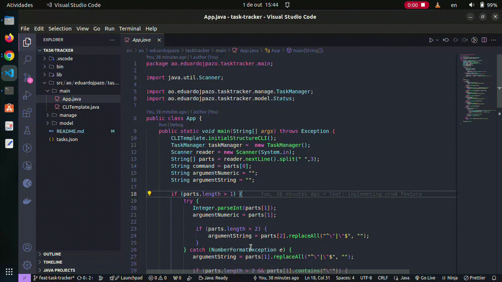

# Getting Started

The simple command-line interface (CLI) solution for the [task-tracker](https://roadmap.sh/projects/task-tracker) challenge from [roadmap.sh](https://roadmap.sh/).

## Features

- **Add a Task:** Add a new task with a description.
- **Update a Task:** Update the description of an existing task.
- **Delete a Task:** Remove a task by its ID.
- **Mark a Task:** Mark a task as "in progress" or "done."
- **List Tasks:** List all tasks or filter them by status (e.g., `todo`, `in progress`, `done`).

## Installation

1. **Clone the repository:**

   ```bash
   git clone https://github.com/eduardojpanzo/training-java
   cd training-java/task-tracker
   ```

2. **Compile the source code and Run the application:**
   - run with an IDE or a text editor, I use vscode
   - exemplo:
     

## Usage

- into the terminal:

```bash
---------------------------------TaskT Tracker---------------------------------
$ add <desc>            - To Create new Task
$ update <id> <desc>    - To update the Task
$ delete <id>           - To delete the Task
$ mark-in-progress <id> - To mark Task in progress
$ mark-done <id>        - To mark task done
$ list                  - To list all tasks
$ list <status>         - To list some taks. status: done | todo | in-progress
------------------------------------------------------------------------------
```

```bash
# Adding a new task
add "Buy groceries"
# Output: Task added successfully (ID: 1)

# Updating a task
update 1 "Buy groceries and cook dinner"
# Output: Task updated successfully (ID: 1)

# Deleting a task
delete 1
# Output: Task deleted successfully (ID: 1)

# Marking a task as in progress
mark-in-progress 1
# Output: Task marked as in progress (ID: 1)

# Marking a task as done
mark-done 1
# Output: Task marked as done (ID: 1)

# Listing all tasks
list
# Output: List of all tasks

# Listing tasks by status
list todo
list in-progress
list done

```

#
